## Flight Fare Prediction

### Table content:

1. Problem Statement

2. Dataset

3. How to run
        
        3.1 Without docker
        
        3.2 With docker

### Problem Statement:

Couple of weeks back I found myself booking airplane tickets for my upcoming vacation. Hence I thought to analyze flight fare prediction dataset and build this regression model to pedict the flight fares between  major cities in india `[Delhi, Mumbai, Kolakata, Banglore, Chennai, Hyderabad]`.

__Note__

Although this web application won't help anyone to check the price of the flights between these cities but I found problem fun to work on for my curiosity.

### Dataset

- __`Clean_Dataset.csv`__: dataset used to analyse and build model.

- __`size`__: 24MB

- __`No. Columns`__: 11

- __`No. Rows`__: 300153

- __Columns Used__: 8 colums used to build and train the model.
                    `airline`
                    `source_city`
                    `departure_time`
                    `stops`
                    `arrival_time` 
                    `destination_city` 
                    `class`
                    `days_left`

- For more analyses, baseline model and hyperparameter tuning checkout `notebook.ipynb` file.

[Download Dataset](https://www.kaggle.com/datasets/shubhambathwal/flight-price-prediction)

### How to run?

For both the cases assuming project repository is aready been cloned.

#### 1. Run without docker.


1. Open the anaconda termial and create new __environment__

```
conda create -n myenv python=3.7
```

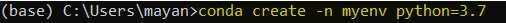


2. Locate conda to project files.

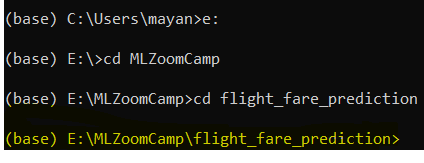

3. Activate the enviroment for the project.

```
conda activate myenv
```

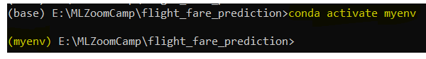


4. __install__ all the required dependencies to run the project.

```
pip install -r requirements.txt
```

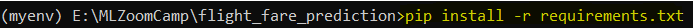


5. __optional__ To run `notebook.ipynb` file `run` extra command.

```
pip install jupyter notebook
```

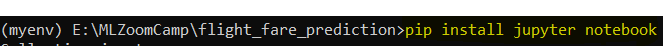


6. __optional__ To train the model: 

```
python train.py
```

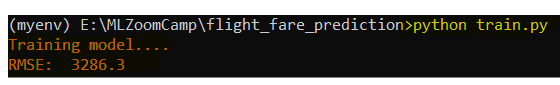


7. Let's launch the __web application__

```
python app.py
```

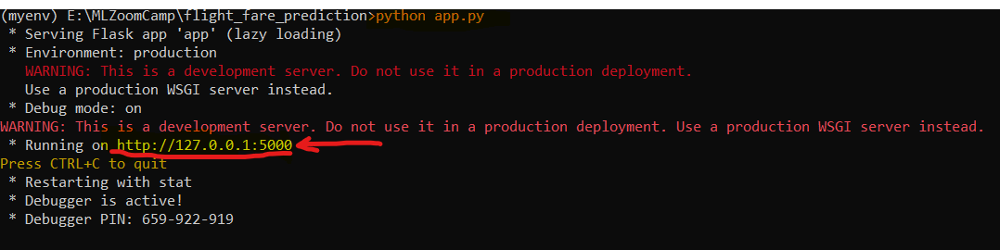


8. Enter the data have fun.


#### 2. Run with docker.

Assuming you already have docker installed and locate conda to project repo


1. On anaconda terminal and `run`.

```
docker build -t app .
```

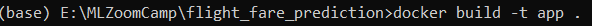


2. Let's check the available files

```
docker run -it app sh
```

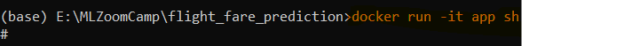


Make Sure that you have all project files copied.

```
ls
```

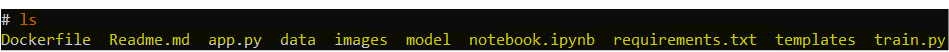

3. Exit.

```
exit
```

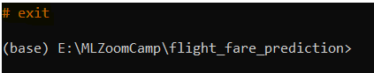


4. Launch the app using dockers. 

```
docker run -p 5000:5000 mlapp
```

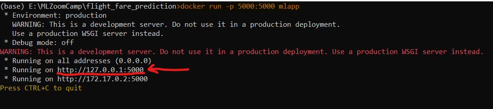

8. Enter the data have fun.


